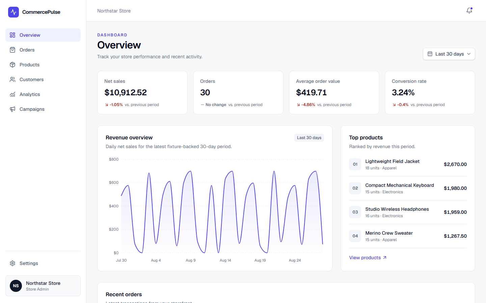
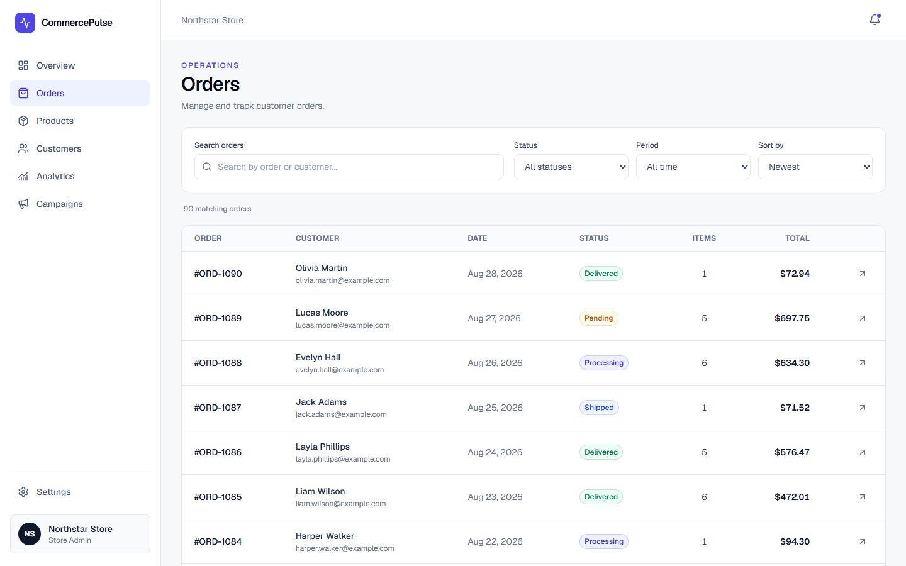
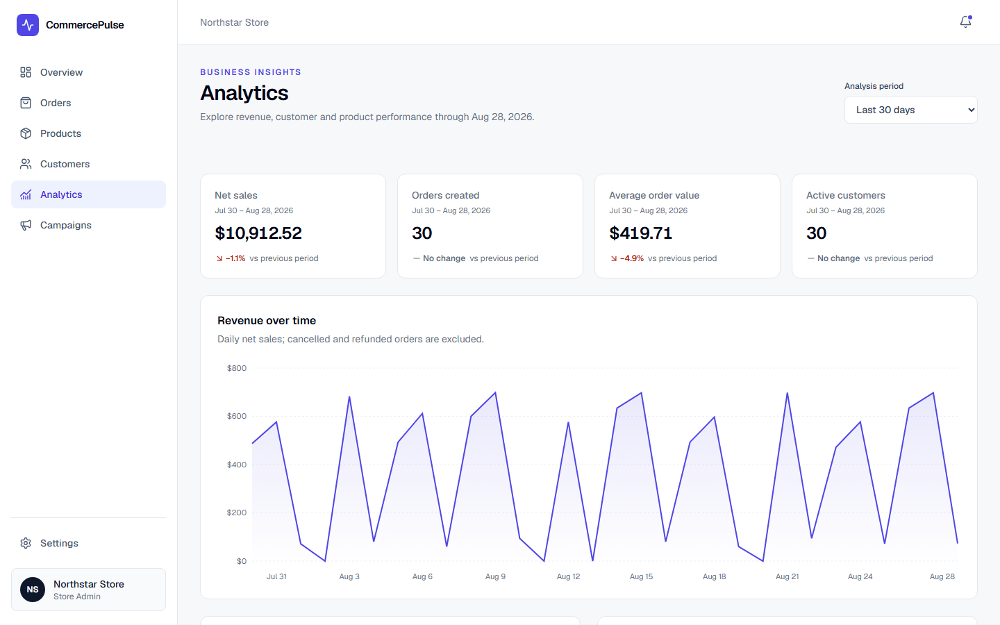
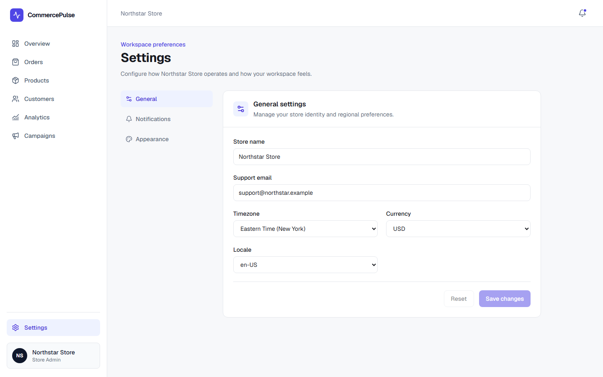
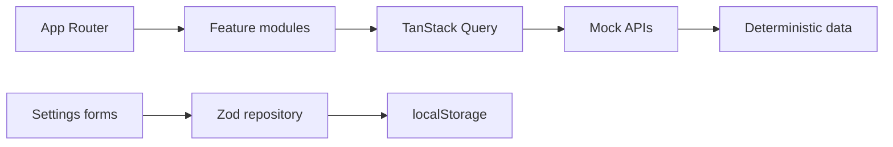
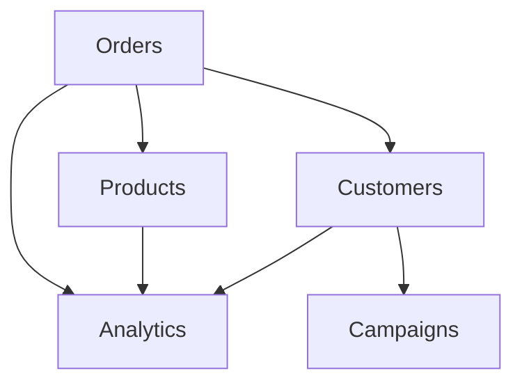
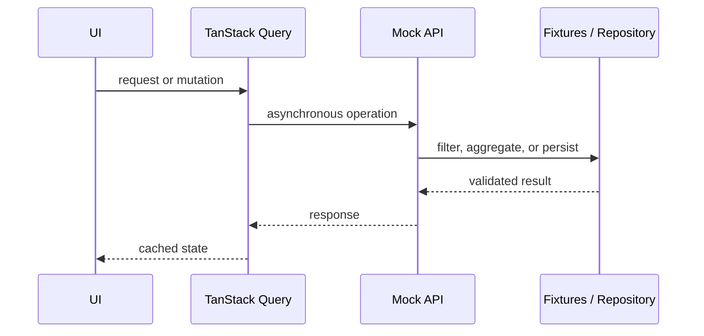

# CommercePulse

**A frontend-focused commerce analytics SaaS built with Next.js, React, and TypeScript.**

CommercePulse simulates the operational workspace of a modern e-commerce business, combining order management, inventory, customer segmentation, analytics, campaign attribution, and persistent settings in a deterministic frontend architecture.

**Current status: v1.0.0 prepared for release.**

## Overview

The application represents **Northstar Store** and is designed as a portfolio project centered on frontend engineering: business rules, cross-domain integrity, asynchronous state, accessible interaction, responsive presentation, and reliable automated testing. Its mock APIs are an intentional replaceable boundary, not direct fixture access from the UI.

## Application Preview

### Dashboard



### Orders



### Analytics



### Settings



## Features

- Reconciled Overview with 30-day sales KPIs, revenue trends, recent orders, and top products
- Order search, status and period filters, sorting, pagination, and dedicated details
- Catalog of 72 products with lifecycle, stock health, inventory thresholds, and performance
- Thirty customers derived from Orders with lifetime value, recency, acquisition, and behavioral segments
- Seven-, 30-, and 90-day analytics with prior-period comparisons and cross-domain insights
- Thirty marketing campaigns with budgets, first-touch attribution, eligible revenue, and ROAS
- Validated General, Notifications, and Appearance settings with independent save/reset behavior
- URL-driven application state, deterministic loading/error behavior, and safe cross-feature return navigation
- Responsive desktop tables and purpose-built mobile cards

## Tech Stack

- Next.js App Router and React
- TypeScript in strict mode
- Tailwind CSS
- TanStack Query
- React Hook Form and Zod
- Recharts
- Radix UI Dialog
- Lucide React
- Vitest, React Testing Library, jsdom, Playwright, and axe-core

## Architecture



Server Components compose routes, metadata, and the application shell. Client boundaries are used for queries, URL controls, charts, dialogs, navigation, and forms. Each feature owns its data boundary, business rules, hooks, UI, and tests.

See [Architecture](docs/architecture.md) for the detailed design and tradeoffs.

## Domain Model

| Domain | Source | Scale | Responsibility |
| --- | --- | ---: | --- |
| Orders | Deterministic fixtures | 90 | Transactional source and order economics |
| Products | Deterministic fixtures | 72 | Catalog, inventory, and merchandise performance |
| Customers | Orders + profiles | 30 | Identity, value, recency, and segmentation |
| Campaigns | Campaigns + customer attribution | 30 | Spend, budget, attributed revenue, and ROAS |
| Analytics | Orders + Products + Customers | 3 periods | Derived business insights and comparisons |
| Settings | Defaults + validated local storage | 3 sections | User preferences and browser-local persistence |



## Data Flow



## Business Rules

Revenue includes pending, processing, shipped, and delivered orders. Cancelled and refunded orders remain visible in counts and distributions but are excluded from net sales, average order value, Analytics revenue, and Campaign revenue.

Customer segmentation applies inactivity first, then loyalty, then recent tenure:

- **At risk:** repeat customer inactive for at least 24 days
- **Loyal:** at least five orders or USD 1,800 lifetime value
- **New:** no more than three orders and first purchase within 69 days
- **Returning:** every other repeat relationship

Campaigns use deterministic first-touch attribution. Each attributed customer belongs to at most one campaign whose channel matches the customer's acquisition source. Analytics windows are inclusive UTC calendar periods anchored to **August 28, 2026**.

## Testing

The current release candidate has:

- **32 Vitest files / 131 tests** covering business rules, cross-domain integrity, APIs, schemas, repositories, URL parsers, and focused components
- **9 Playwright files / 51 tests** covering user workflows, persistence, metadata, keyboard behavior, return navigation, and responsive application flows
- **7 axe accessibility smoke tests** within the Playwright suite, covering every primary route with no serious or critical violations

Tests emphasize behavior and data integrity rather than implementation details. The Playwright server uses port **3100** to remain isolated from normal local development.

## Quality

GitHub Actions is configured for pushes and pull requests to `main` with two jobs:

- **Quality:** clean install, lint, TypeScript, Vitest, and production build
- **End-to-end:** clean install, Chromium setup, Playwright, and failure-only diagnostic artifacts

The workflow is configured but must still be validated on GitHub after this branch is pushed. No unverified CI badge is displayed.

## Getting Started

### Requirements

- Node.js 22 or newer
- npm

### Installation

```bash
npm ci
```

### Development

```bash
npm run dev
```

Open [http://localhost:3000](http://localhost:3000).

## Available Scripts

| Command | Purpose |
| --- | --- |
| `npm run dev` | Start the development server |
| `npm run build` | Create an optimized production build |
| `npm run start` | Serve the production build |
| `npm run lint` | Run ESLint |
| `npm run typecheck` | Validate TypeScript without emitting files |
| `npm test` | Start Vitest in watch mode |
| `npm run test:run` | Run unit and component tests once |
| `npm run test:e2e` | Run the Playwright and axe suite |

Playwright requires Chromium on the first run:

```bash
npx playwright install chromium
```

## Project Structure

```text
commerce-pulse/
├── .github/                 CI workflow and pull request template
├── docs/                    Architecture, demo, release notes, and screenshots
├── e2e/                     Playwright workflows and accessibility smoke tests
├── src/
│   ├── app/                 App Router routes, metadata, and error boundaries
│   ├── components/          Shared layout, providers, and UI primitives
│   ├── features/            Domain modules and colocated tests
│   ├── hooks/               Shared React hooks
│   ├── lib/                 Shared formatting, latency, and URL safety
│   ├── mocks/               Dashboard projections
│   └── types/               Shared domain contracts
└── package.json
```

## Accessibility

CommercePulse uses semantic headings and landmarks, labelled forms and charts, table captions and headers, visible focus styles, keyboard-operable dialogs, native controls, reduced-motion handling, and textual status indicators. Automated axe coverage checks WCAG A/AA rules for serious and critical violations; keyboard and responsive behavior are also covered by Playwright and manual review.

## Responsive Design

The persistent desktop sidebar becomes an accessible mobile drawer. Dense tables adapt to task-focused cards, filters reflow without losing labels, and Settings navigation becomes horizontally scrollable. The release candidate is reviewed at 1440×1000, 768×1024, and 390×844.

## Frontend Engineering Highlights

- URL state instead of hidden global state for shareable, reload-safe workspaces
- Deterministic fixtures and an explicit reference date for reproducible analytics
- Cross-domain integrity between orders, products, customers, campaigns, and insights
- TanStack Query behavior exercised through replaceable asynchronous mock APIs
- Safe internal return URLs that reject external navigation targets
- Accessible forms with schema validation, mutation feedback, and unsaved-change protection
- First-touch campaign attribution and analytics derived from existing domain truth
- Distinct desktop and mobile information architecture backed by 182 automated tests

## Limitations

- Frontend-only: mock APIs run in the browser and do not call a real service
- Settings use localStorage and do not synchronize across browsers or users
- Fixture data is deterministic and does not represent live commerce activity
- No authentication, database, payment integration, or real notification delivery

These constraints keep the project focused on observable frontend architecture and product behavior.

## Roadmap

After v1.0.0, optional extensions could include a real backend adapter, authenticated persistence, or deployment-specific observability. They are intentionally outside the release candidate scope.

## Release

- [v1.0.0 release notes](docs/releases/v1.0.0.md)
- [Changelog](CHANGELOG.md)
- [Recruiter demo guide](docs/demo.md)

The package version is prepared as `1.0.0`, but no Git tag or GitHub Release has been created.

## License

No open-source license is currently included. A license should be selected explicitly by the repository owner before redistribution terms are offered.
