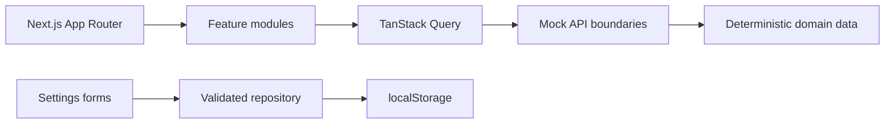
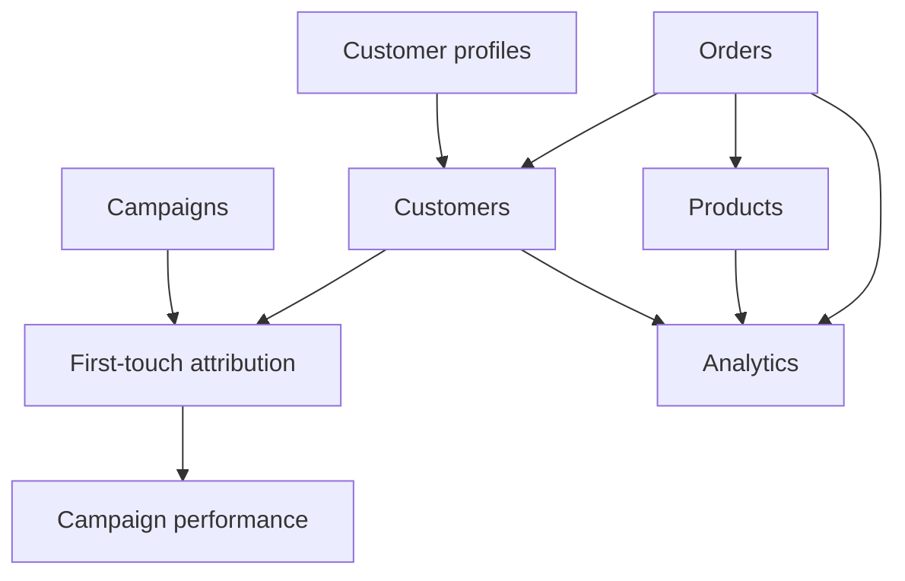

# Architecture

## Overview

CommercePulse is a frontend-focused Next.js application organized around business features rather than technical layers. It uses deterministic fixtures and asynchronous mock API boundaries to demonstrate production-style client behavior without requiring a backend.



## App Router

Routes live under `src/app`. The dashboard route group supplies the shared application shell while preserving clean URLs such as `/orders` and `/analytics`. List pages are statically generated; detail routes are rendered dynamically because their IDs arrive through route parameters.

The root layout owns global metadata, fonts, styling, and the single TanStack Query provider. Route-level metadata supplies specific browser titles and descriptions.

## Feature Boundaries

Each domain under `src/features` owns its API, fixtures or aggregation logic, URL parsing, hooks, components, and colocated tests. Shared layout primitives, formatting, latency, and safe return URL logic remain outside feature folders.

```text
feature/
├── api/          asynchronous data boundary
├── components/   domain presentation and interaction
├── fixtures/     deterministic source data, when owned by the feature
├── hooks/        query and URL-state integration
├── lib/          business rules and pure transformations
└── types.ts      feature-specific contracts
```

## Server and Client Components

Server Components remain the default for route composition, metadata, and static shells. Client Components are limited to browser-dependent behavior: URL controls, queries, charts, dialogs, mobile navigation, and forms. Large feature workspaces become client boundaries because their mock APIs and interactions intentionally simulate a browser application.

## Data Model

Orders are the main transactional source. Products must resolve every order item. Customers are aggregated from order identity and deterministic profile enrichment. Campaign attribution connects eligible customers to campaigns. Analytics derives its metrics from those established domains rather than maintaining a duplicate reporting dataset.



## Mock API Architecture

Mock APIs introduce deterministic latency, filtering, sorting, pagination, and controlled development failures. UI components consume API hooks rather than fixture arrays, keeping the data boundary replaceable by a real HTTP client later.

## TanStack Query

One `QueryClient` is created for the application provider. Query keys are feature-scoped and include list parameters where needed. Queries preserve prior list data during URL changes; mutations update the Settings cache only after the repository write succeeds.

## URL State

Search, filters, sorting, pagination, analytics periods, and Settings sections are encoded in the URL. Parsers normalize unsupported values to safe defaults. Detail links carry validated internal return destinations so users can return to their prior list state while external and unrelated URLs are rejected.

## Deterministic Fixtures

The dataset contains 90 orders, 72 products, 30 derived customers, and 30 campaigns. Time-dependent calculations are anchored to August 28, 2026, making screenshots, metrics, comparisons, and tests reproducible.

## Persistence

Settings use React Hook Form and Zod. A repository owns `commerce-pulse.settings.v1`, validates the complete stored document, and falls back to defaults when data is missing, corrupt, partial, or invalid. Persistence is local to the browser and intentionally separate from components.

## Cross-Domain Relationships

- Every order item references an existing product ID and SKU.
- Every customer identity is derived from one or more orders and enriched by exactly one profile.
- Campaign attribution is unique per customer and must match the customer's acquisition channel.
- Analytics uses the same revenue eligibility rule as Campaigns and the Overview dashboard.

## Testing Architecture

Vitest covers business rules, fixtures, parsers, repositories, API behavior, and focused React components. Playwright covers user workflows, URL reconstruction, persistence, cross-feature navigation, metadata, keyboard interaction, and accessibility. Axe smoke tests fail on serious or critical WCAG A/AA violations across every primary route. The E2E server remains isolated on port 3100.
